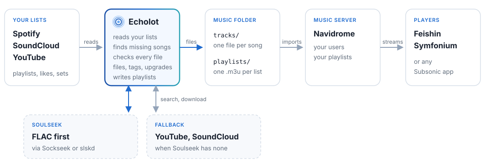

<p align="center">
  
</p>

<p align="center">
  Your Spotify, SoundCloud and YouTube lists as a music library on your own server.<br>
  Every song once, as the right file, in the best quality it can find.
</p>

---

You follow playlists and likes. Echolot keeps a copy of all of it as plain audio files
(`Artist/Artist - Title.flac`), adds new songs by itself, swaps worse copies for better ones, and turns
each list into a playlist for [Navidrome](https://www.navidrome.org) or any Subsonic app. Whatever it
cannot find yet, it tells you, and why.

<p align="center">
  
</p>

## What it does

- **Syncs your lists.** Spotify playlists and likes, SoundCloud likes and sets, YouTube playlists, yours
  or anyone's public ones.
- **Downloads the songs.** From Soulseek, FLAC first, with YouTube and SoundCloud as the fallback. Lossy
  copies get upgraded to a genuine FLAC later, and fakes (FLACs made from MP3s) are spotted.
- **Verifies every file.** Correctness comes first: artist, title, version and length have to match, and
  the audio is compared with the official release. Anything unsure waits on the Review page, with a player.
- **Keeps it tidy.** One file per song, however many lists hold it, tagged as the song in your list.
  Nothing is overwritten; a replaced file waits 30 days before it goes.
- **Explains the gaps.** For every missing song: what was searched, what came back, why it didn't fit.
  A file you have yourself can be uploaded and is checked the same way.
- **Statistics.** Growth over time, quality per list, and what changed on Spotify and SoundCloud (songs
  taken down, greyed out, re-uploaded).
- **Multi-user.** Everyone logs in with their Navidrome account and follows their own lists.

## What it doesn't do

Echolot won't find you new music, and it never changes your lists on Spotify, SoundCloud or YouTube: it
only reads them. No artist pages, no album hunting, no recommendations. If that's what you're after,
[SoulSync](https://github.com/Nezreka/SoulSync) is the better fit; it does much of what Echolot does,
and a lot more. If your goal is an archive of what you already listen to, complete, correct and in the
best quality (niche stuff included, SoundCloud and all), give Echolot a try. The two also run fine side
by side.

> Echolot is still in beta. It has been run in and tuned on a library of a few thousand songs, but
> expect the odd rough edge.

## Quick start

**You need** Docker with Compose, and for Spotify a Premium account (Spotify only runs developer apps
of Premium users). Soulseek needs no sign-up.

**1. Get the files**

```sh
git clone https://github.com/Zweisteinium/echolot
cd echolot/deploy
cp .env.example .env
```

**2. Set your music folder.** In `.env`, set `MUSIC` to a folder you own (an empty one, or a new one).
Check `PUID`, `PGID` and `TZ` while you are there.

**3. Start**

```sh
mkdir -p data/echolot data/sockseek data/navidrome
docker compose up -d
```

The first start builds the Soulseek daemon, which takes a few minutes.

**4. Log in**

1. Open Navidrome at `http://<host>:4533` and create its admin account. Do this first: Echolot's
   users are Navidrome's users.
2. Open Echolot at `http://<host>:8490` and log in with that account.
3. In **Settings → Access**, enter the same account as the service account.

**5. Connect and pick**

1. **Accounts** walks you through the Spotify app, the SoundCloud login and a Soulseek name.
2. **Sources**: pick the lists to follow.

The first songs show up within minutes. Listen in Navidrome or any Subsonic app.

## Accounts

- **Spotify.** One person creates a developer app (free, two minutes, the Accounts page has the steps)
  with a Premium account; it stops working when that Premium ends. Others need no Premium: the app's
  owner adds their Spotify accounts in the app's User Management, up to five. Spotify's own mixes and
  editorial playlists can't be read; copy their songs into a playlist of yours. (Spotify's limits for
  apps like this: [quota modes](https://developer.spotify.com/documentation/web-api/concepts/quota-modes).)
- **SoundCloud.** SoundCloud hands out no app keys, so Echolot uses your browser's login token (the
  Accounts page shows where to find it). After you log out of SoundCloud in that browser, paste a new one.
- **Soulseek.** Nothing to register: pick a name and a password, and the first login creates the
  account. There is no password recovery, so keep them. A name can only be online in one client at a
  time. Many people on Soulseek don't share with accounts that share nothing, and the bundled daemon
  shares nothing; slskd does (see below).
- **YouTube.** Nothing to connect. Follow a playlist by its link.

## Setups

<details>
<summary><b>With a Navidrome you already run</b></summary>

Set `NAVIDROME_URL` in `.env` and remove the `navidrome` service from `compose.yaml`. Give Echolot its
own folder inside Navidrome's music folder (say `MUSIC=/srv/music/echolot` when Navidrome reads
`/srv/music`); Echolot puts a `.ndignore` into its `inbox/`, so Navidrome skips the downloads. With
Navidrome 0.58 or later you can add that folder as a second library instead.

Navidrome has to import playlists (`ND_AUTOIMPORTPLAYLISTS`, on by default). It imports them all as its
first admin's; Echolot then hands each one to its user and never touches playlists it didn't write.
Songs you already have in your own library will show up twice.
</details>

<details>
<summary><b>With a music library you already have</b></summary>

Give Echolot a folder of its own and let it be the only one writing there. It only understands
`tracks/<Artist>/<Artist> - <Title>.<ext>`: a library in another layout is invisible to it (everything
would be downloaded again), and in its own layout it replaces files with better copies and renames them.
Both folders can go into the same Navidrome.
</details>

<details>
<summary><b>Soulseek through a VPN</b></summary>

Soulseek peers see your IP address. Fill in the VPN lines in `.env` and start with
`docker compose -f compose.yaml -f vpn.yaml up -d`: [gluetun](https://github.com/qdm12/gluetun) then
carries the Soulseek traffic (YouTube and SoundCloud stay on your own connection; they don't like VPNs).
With a provider that forwards a port, peers behind a firewall can send to you too.
</details>

<details>
<summary><b>slskd as the Soulseek client</b></summary>

[slskd](https://github.com/slskd/slskd) is a full Soulseek client: it shares, so fewer peers turn you
down. On **Accounts → Soulseek**, choose slskd and enter its address, its web login (or an API key)
and its downloads folder as Echolot sees it. Two things matter:

- the downloads folder has to be on Echolot's music volume (`MUSIC/inbox/slskd` is a good place),
- slskd has to run as Echolot's user (`user: "1000:1000"`, your `PUID:PGID`), or Echolot can't move
  the files it downloads.

Share some music in slskd (Echolot's `tracks/`, read-only, does the job). The bundled Sockseek daemon
is then unused.
</details>

<details>
<summary><b>Behind a reverse proxy</b></summary>

Add `FORWARDED_ALLOW_IPS` with the proxy's address to Echolot's `environment` in `compose.yaml`, so it
trusts the proxy's headers. Over https, the Spotify login comes back to Echolot by itself; over plain
http you paste one address back (the Accounts page shows where).
</details>

<details>
<summary><b>Next to other services</b></summary>

| Service | Works next to Echolot if |
|---|---|
| slskd | it doesn't use the same Soulseek name as the daemon at the same time (the newer login kicks the other). Or let Echolot use slskd. |
| Lidarr, Soularr | they have their own root folder, never Echolot's `tracks/`. |
| beets | it stays out of Echolot's folder: it renames and retags, and Echolot finds songs by their names. |
| Jellyfin | you're fine with its playlists being shared: it imports the `.m3u` files for everyone with access. |
| Plex | you don't need the playlists: it reads `tracks/` but not `.m3u` files. |
| Subsonic apps | always: through Navidrome, each user with their own playlists. |
</details>

## How it works

<p align="center">
  
</p>

1. **Lists.** Echolot reads the lists you follow and keeps every song once. A song the library already
   has under another name is linked, not downloaded again.
2. **Search.** A missing song is searched on Soulseek. Every result is judged by its path and length
   before anything is downloaded; the best one is fetched, then the next if it stalls (up to five).
   SoundCloud songs come straight from SoundCloud.
3. **Fallback.** What Soulseek doesn't have is searched right away on YouTube (the official audio first),
   then on SoundCloud. Songs found nowhere are tried again every evening, with looser terms after a few
   misses, weekly after a week.
4. **Check.** Each download is repaired and normalised (WAV, AIFF and ALAC become FLAC, hi-res becomes
   44.1/48 kHz 24 bit), spectrum-checked and identified by name and by sound.
5. **File.** Into `tracks/<Artist>/`. A genuine FLAC replaces a lossy or fake copy.
6. **Upgrade.** Lossy songs are searched again, FLAC only, the longest waiting first.
7. **Playlists.** One `.m3u` per list, in list order, with its cover, in `playlists/<user>/`.

<details>
<summary><b>When is a file the song?</b></summary>

- **Same song:** the same artist (any of the song's artists, ignoring case, accents and punctuation),
  the same title once noise is gone ("(Original Mix)", "(feat. X)", "[HAK003]", "- 2011 Remaster",
  "(Official Video)"), a length within 10 s (4 % for songs over about four minutes).
  Version words (remix, edit, extended, VIP, live, Pt. 2) and other featured artists keep songs apart;
  a cut from a DJ mix is the song at any length.
- **Before a download:** a result is skipped when it names another version or lacks the one asked for,
  has another song's length, was marked wrong before, or doesn't name the artist as a name of its own
  ("HK", not "HK Gruber").
- **After a download:** *exact* (the title matches) is filed; *probable* (the core title matches, length
  within 3 s) is filed and listed for review; the rest is rejected, near misses wait for review.
- **The sound:** from 0.8 of the fingerprint in common with the release's preview, a download is the
  recording (a probable match is then filed as exact); up to 0.7 it is another one, which sends even an
  exact name to review. A file tagged with the song's ISRC counts as the recording.
</details>

## Configuration

Nearly everything lives in the web app (**Settings**: schedule, Soulseek, access; and `echolot.yml`, all
lists and settings in one file for a backup or a second install). `.env` only has the basics:

| Variable | Default | |
|---|---|---|
| `MUSIC` | (required) | your music folder |
| `PUID`, `PGID` | `1000` | the user and group the containers run as |
| `TZ` | `UTC` | your time zone (for the job times) |
| `ECHOLOT_PORT`, `NAVIDROME_PORT` | `8490`, `4533` | the ports on the host |
| `NAVIDROME_URL` | the bundled one | your own Navidrome |
| `VPN_*`, `WIREGUARD_PRIVATE_KEY`, `SERVER_COUNTRIES` | | only with `vpn.yaml`, see the [gluetun wiki](https://github.com/qdm12/gluetun-wiki) |

<details>
<summary><b>What the Echolot container reads</b></summary>

`compose.yaml` sets the first ones for you.

| Variable | Default | |
|---|---|---|
| `ECHOLOT_LIBRARY_DIR` | `/music/tracks` | the library; must end in `tracks`, with `inbox/` and `playlists/` next to it |
| `ECHOLOT_DAEMON_DIR` | `/daemon` | where Echolot writes the Soulseek daemon's login |
| `ECHOLOT_NAVIDROME_URL` | `http://navidrome:4533` | Navidrome's address, unless Settings has another |
| `ECHOLOT_DATA_DIR` | `/data` | the database and Echolot's own files |
| `ECHOLOT_SECRET_KEY`, `ECHOLOT_SECRET_KEY_FILE` | | the key for stored passwords and tokens; without one, `data/secret.key` is made (so a copy of `data/` holds both) |
| `ECHOLOT_WORKER` | `on` | `off` runs no jobs (for a test copy) |
| `ECHOLOT_HOST`, `ECHOLOT_PORT` | `0.0.0.0`, `8490` | where it listens inside the container |
| `FORWARDED_ALLOW_IPS` | `127.0.0.1` | the reverse proxy whose `X-Forwarded-*` headers count |
</details>

## Running it

- **Jobs** run on their own schedule (Settings); the Overview starts, stops and pauses them.
- **Activity** lists everything filed and rejected; `docker compose logs echolot` has the details.
- **Users** are Navidrome's accounts; Navidrome admins are admins here too, and **Users** gives others
  more rights. Locked out: `docker compose exec echolot echolot user admin <name>`.
- **Backups:** `deploy/data/` and your music folder. Stop Echolot first for a clean copy of its database.
- **Limits:** Soulseek allows about 34 searches every 220 seconds, so a long list takes a while.
- **Updates:** read the release notes, then:

```sh
git pull
docker compose pull
docker compose build sockseek
docker compose up -d
```

<details>
<summary><b>The jobs and their defaults</b></summary>

| Job | Default | What it does |
|---|---|---|
| Spotify lists | every 2 min | reads the lists that changed; new songs start a search |
| New songs search | after a list job finds new songs | the library first, then Soulseek |
| New SoundCloud songs | every 5 min | reads the lists that changed and downloads new songs |
| YouTube lists | every 30 min | reads each playlist |
| YouTube & SoundCloud search | every 2 h, and after a Soulseek miss | the fallback |
| Missing songs | 20:00, weekends also 15:00 | Soulseek again for songs found nowhere |
| FLAC upgrade | 14:00 and 20:30 | FLAC-only searches for lossy songs |
| Availability check | 05:30 | whether your songs still play on Spotify and SoundCloud |
| Library upkeep | every 5 min | rescans the files, applies review decisions, writes the playlists |
| FLAC upgrade for all songs, Covers | off | start them by hand |
</details>

## API and metrics

Scripts use an API token from your account page (click your name): `Authorization: Bearer <token>`.
`/api/docs` lists every endpoint.

| Endpoint | Returns |
|---|---|
| `GET /metrics` | the library, songs and lists for Prometheus (with a token, or without one if Settings allows it) |
| `GET /api/stats`, `/api/stats/history?metric=…` | the latest hourly numbers, and one of them over time |
| `GET /api/stats/downloads?days=30` | filed and rejected per day, source and format |
| `GET /api/jobs`, `POST /jobs/<name>/run` | the jobs, and starting one |
| `GET /api/config`, `PUT /api/config` | everything as `echolot.yml` |

## Development

You need [uv](https://docs.astral.sh/uv/).

```sh
uv sync
uv run pytest
uv run ruff check
uv run ruff format
uv run echolot serve
```

The audio tests need ffmpeg, like the image. `echolot serve` listens on http://127.0.0.1:8490.

| `src/echolot/` | |
|---|---|
| `cli.py`, `config.py`, `db.py` | the command line, the environment, the database |
| `settings/` | settings, stored secrets, logins and tokens, the followed lists, `echolot.yml` |
| `services/` | Spotify, SoundCloud, YouTube, Navidrome, the Soulseek clients (Sockseek, slskd), yt-dlp |
| `library/` | the matching rules, the audio check, tags, the catalog, filing, review, uploads, playlists, statistics |
| `jobs/` | the worker and its schedule, finding songs, reading lists |
| `web/` | the pages and the API |

CI tests every push and builds the image on amd64 and arm64. A new version in `pyproject.toml` (and
`deploy/compose.yaml`, a test checks both) is released when it lands on `main`: CI tags it, publishes
the release and pushes `lordlayer/echolot` to Docker Hub for both platforms.

## Fair use

Echolot sorts, checks and de-duplicates audio files and keeps them in step with your lists. What you get
through the sources you connect is your business: use it for music you are entitled to, and stick to
the terms of those services and the law where you live. Echolot does not break copy protection.

## License

[GNU AGPL v3](LICENSE)
